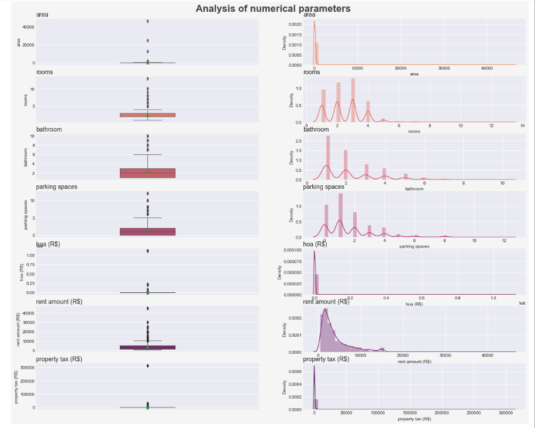

# machine-learn-rent-prediction

 

<h1 align="center"> 🧮 Machine learn | Rent prediction </h1>

## Project Status

:heavy_check_mark: Complete

## Table of Contents 
- [Objective](#objective)
- [Process](#Process)
- [Results](#Results)
- [Authors](#Authors)

## Objective
For this project the objective is to create a machine learning solution to predict the average rent in the city of São Paulo. Alongside with the prediction, an API will be built to serve the model.

## Data exploration
Here it was imported the data containing all the information about renting in major cities of Brazil. In order to explore and build a robust model, it was decided to work on top of only São Paulo data. To better visualize the data it was built graphs that would aid finding outliers and bad data.

## Data treatment
For this section it was removed any unwanted columns, outliers and bad data. Also it was established a correlation graph to verify which features present the most impact when it comes to rent price.

 

## Model creation
Using the <a href="https://scikit-learn.org/stable/modules/generated/sklearn.ensemble.RandomForestRegressor.html" target="blank"> random forest regressor from scikit-learn </a> as the prediction model, it was possible to train the data and compare the results to the actual sample. After the model was built, using <a href="https://joblib.readthedocs.io/en/latest/ target="blank"> joblib </a> it was exported to be further implemented in an API.

## API creation

